# UI findings — 2026-10-03

What the automated UI tests found. Nothing here has been fixed yet: you pick the order, and
each fix turns its check from report-only into a blocking test. Source: `UI tests` run 37154148160 (all green: 491 tests passed, 0 failed, 0 crashes;
29 runs, 437 screenshots; 18 screens × 9 phone profiles × Hebrew/English, and journeys on
Android 8, 10, 13, 14 and 15). The latest full report and every screenshot are on the
`ci-screens` branch; the images below are copies, so they stay valid after later runs.

Profiles: P1 old/budget 360×640 dp · P2 same at font 1.3 · P3 narrow 320×693 · P4 Samsung
A-class 384×832 · P5 same at font 2.0 · P6 Pixel-class 411×914 · P7 Fold cover 344×882 ·
P8 landscape 914×411 · P9 tablet 841×701.

## What already works everywhere

- **Journeys** on all five Android versions:
  - search by taps;
  - "Remind me" arms a reminder;
  - rotation and a dark-mode switch keep the results;
  - each car tab searches once per slider release, within its request budget;
  - no signal shows the saved results, and Retry works;
  - "Send to driver" shares Waze + Google links;
  - the **GPS "get off next stop" alert fires** near the stop (mock GPS);
  - the update banner shows and dismisses.
- **Stability:** no crash or ANR in a 6000-event monkey run (seed 4242), and the app comes
  back after the system kills it.
- **Hebrew strings:** both languages hold the same strings with matching placeholders
  (`tools/check_strings.py`). The routing sanity checks on 10 real trips all pass
  (`./gradlew -p core goldenTrips`).

## Findings, most serious first

### F1. Results cover the search card — you can't see or change From/To
Rules R1 and J10. Hits 10–17 of 18 screens on **every** profile.

The results panel and the search card are stacked independently (`MainScreen.kt:120-143`).
Once results show, the panel slides over the From/To rows and the time chips; only the
mode tabs stay visible. It also hides the Settings and History buttons: a tap on Settings
lands on the panel (journey J10, confirmed on Android 8, 10, 13, 14 and 15). With the largest font (P5) or in landscape (P8), the
panel covers the whole screen.

 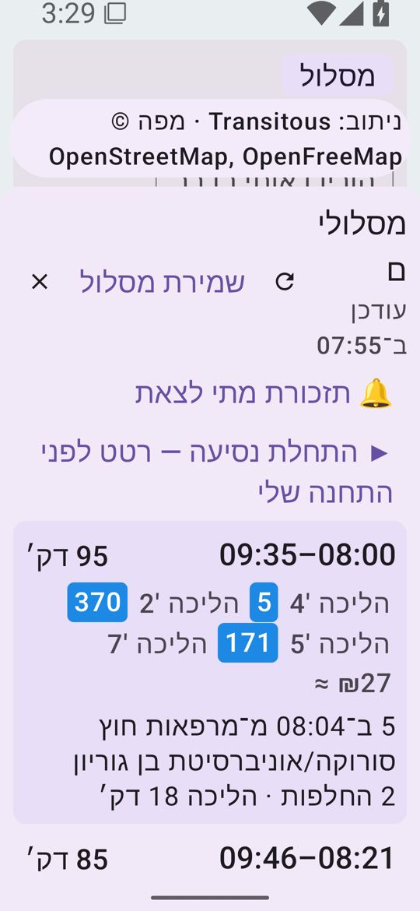
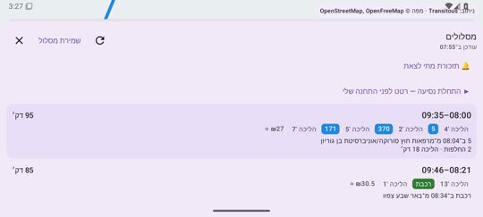

**Fix:**
- Lay the two out together: measure the search card and cap the panel at the height left
  below it.
- Or collapse the search card to a one-line "From → To · time" summary while results show.
- Or use a bottom sheet with a peek height.

### F2. Back exits the app
Rule J4. Hits Android 8, 10, 13, 14 and 15.

There is no `BackHandler`. Back with the search field, results or a stop's departures open
leaves the app instead of closing what is open.

**Fix:** a `BackHandler` in `MainScreen` that steps back in this order: editing, stop
sheet, results, then the system default.

**Status (#32):** fixed on Android 9 and later (one Back closes the search, keyboard or
not). **Android 8 (2026-10-06):** not an app bug. On the API 26 emulator SystemUI's crash
dialog ("System UI has stopped") held the key focus, so the first Back closed that dialog
and never reached the app. J4 now clears the dialog first and needs one Back on every API
(blocking).

### F3. Almost no map is visible
Rule R7. Hits all 16 result screens on every profile.

Even on a tall Pixel-class phone (P6, 914 dp), the search card plus the results panel
leave a sliver of map, so the drawn route can't be seen. The camera fit uses hard-coded
padding (top 200 dp, bottom 380 dp; `MainActivity.kt:106`) that doesn't match either panel.

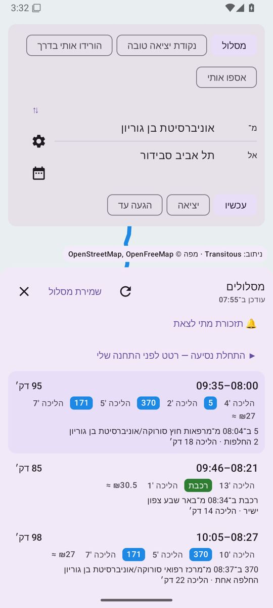

**Fix:**
- Comes with F1: a collapsible panel, with the panel's real measured heights as the map
  padding.
- Selecting an option could collapse the list to that one card.

### F4. The attribution chip floats over content
Rule R1. Hits small and narrow profiles.

"Routing: Transitous · Map © …" sits on top of the search card or the From/To rows
whenever a panel is open (P1, P3). With the update banner showing, it overlaps the banner
too. The link itself is required by Transitous, but it has to be placed, not floated.

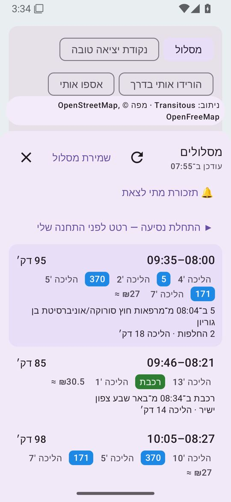 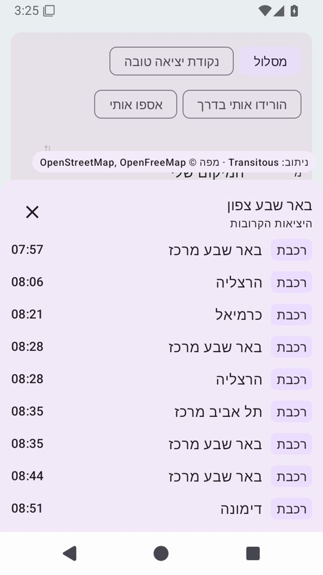

**Fix:** put it inside the bottom panel (last row), or in the map's corner above the panel
edge.

### F5. Search suggestions run off the screen
Rule R2. Hits P1, P2 and P3.

The suggestion list is capped at 360 dp under the search card. On a 640 dp phone it runs
under the attribution chip and the navigation bar, so its last items can't be tapped. The
Activity is edge-to-edge without `imePadding`, so with the soft keyboard up, more of it is
hidden.

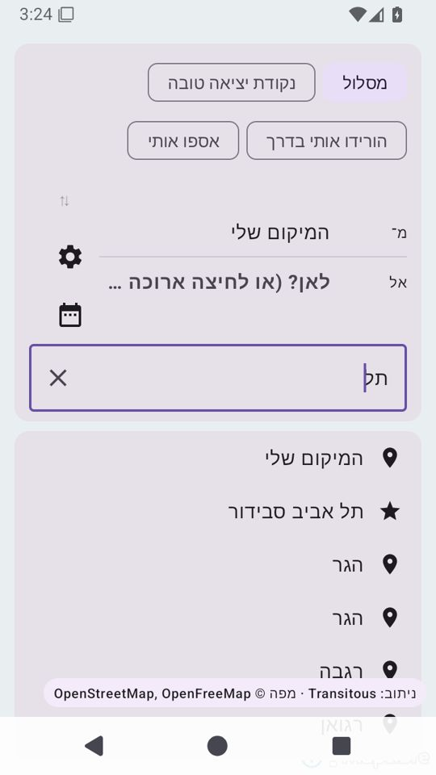

**Fix:**
- Size the list to the space left (`weight` inside the column, not a fixed `heightIn`).
- Add `imePadding()` and `navigationBarsPadding()`.

### F6. Bus chips have low contrast
Rule R5, confirmed independently by `ContrastTest` and Google's Accessibility Test
Framework.

White text on the default bus blue `#1E88E5` is 3.68:1, under the 4.5:1 that 12 sp text
needs. Bus is the most common chip.

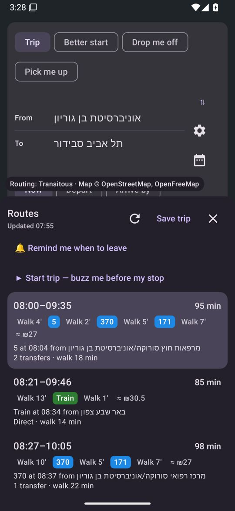

**Fix:**
- Use the new `chipTextColor(bg)` in `LegChipView`. It picks black or white by contrast,
  and is tested for every default and route colour.
- Or darken the bus blue to `#1565C0` (5.75:1 with white).

### F7. Place labels are squeezed into a fixed 64 dp column
Rule R3. Hits P3 and P5.

"Driver to" / "הנהג/ת אל" and "I go to" / "אני אל" wrap onto two lines at 320 dp. At font
2.0 they break mid-phrase (`MainScreen.kt:281`).

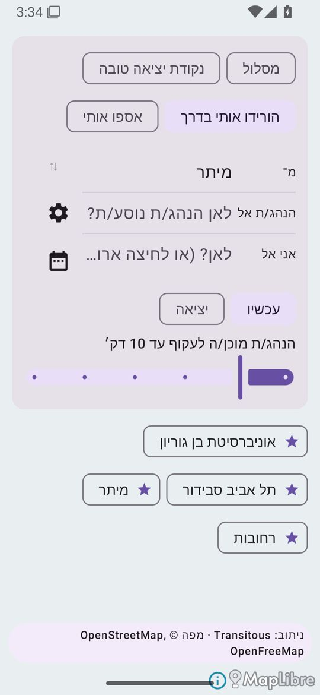 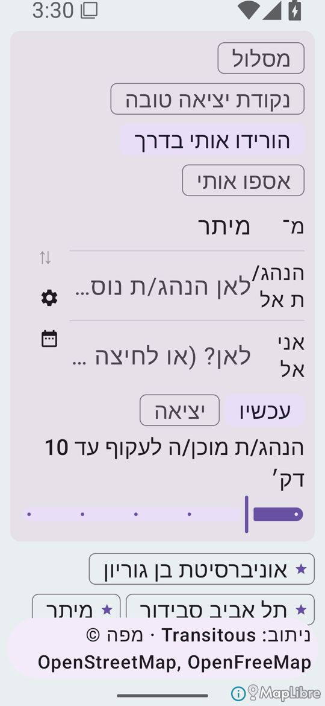

**Fix:** size the label to its content (`widthIn(min = 48.dp)`), or put the label above
the value when the text is large.

### F8. The Hebrew update banner reads "9.9.9v"
The string has the "v" outside the bidi isolate: `גרסה חדשה זמינה: v⁨%s⁩`.

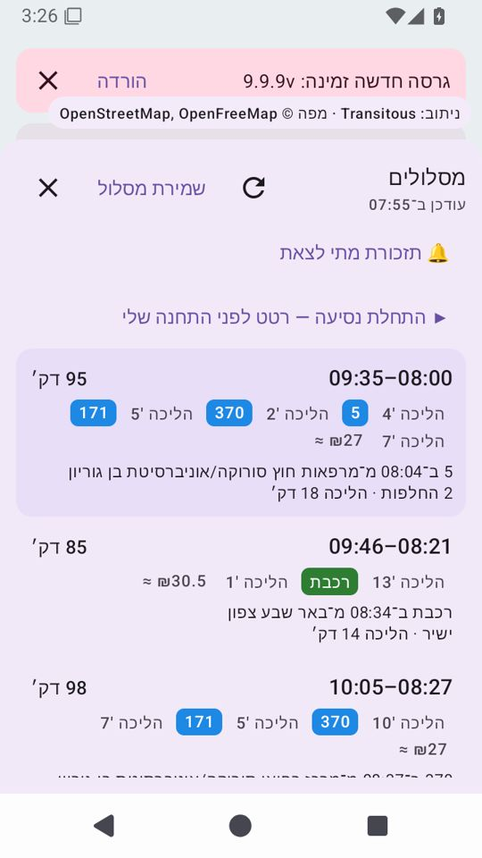

**Fix:** `⁨v%s⁩`. Then add a rule to `tools/check_strings.py`: no Latin letter
glued to an isolate in Hebrew.

### F9. Tablet and landscape just stretch the phone layout
P8 and P9.

Full-width chips and cards, the panel covering the screen (F1), and the map unused. A
friend's tablet or a car-mounted phone in landscape gets the worst version.

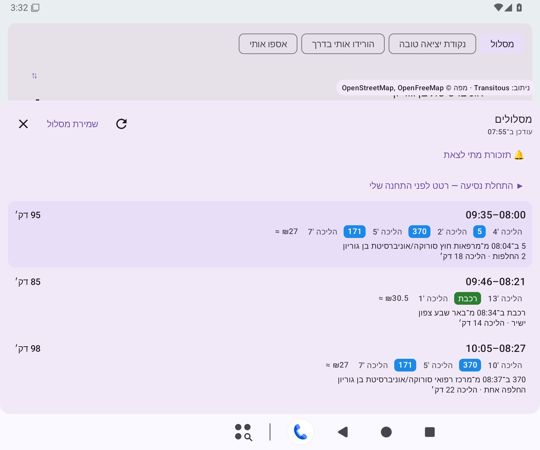

**Fix:** above 600 dp wide, put the search and results in a side column (about 380 dp) and
give the rest to the map.

### F10. Small details
- **Swap button:** the "⇅" is a tiny, grey glyph in a 40 dp-high button, easy to miss.
  Fix: an icon (`Icons.Default.SwapVert`) in a proper `IconButton`.
- **Large font (P5):** the results header wraps ("מסלולים" breaks; "Updated 07:55" takes
  three lines) because the header row shares its width with three buttons. Fix: move "Save
  trip" into an overflow menu, or let the title take the full width.

## What these tests can't tell (still the owner's phone)

- GPS on a moving bus.
- Alarms under real battery savers (Samsung, Xiaomi).
- Real-time data on a weekday.
- How it feels in the hand.

Real-phone runs on Firebase Test Lab (free Spark plan) are ready in `devices.yml` once it
is set up (skill `ui-testing`).
